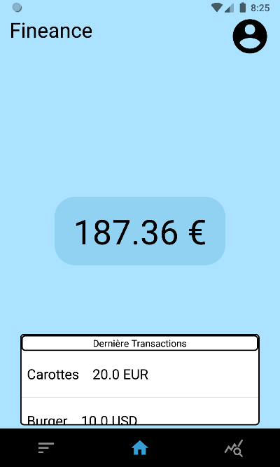
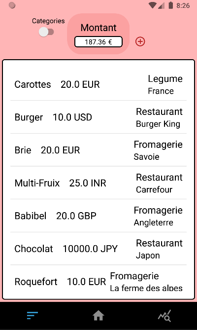
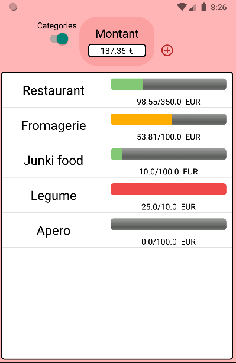
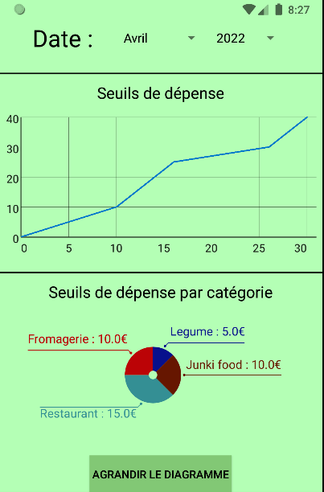

# FineAnce

## Authors:
* Theo Jannes
* Mourad Karrakchou
* Benoit Gaudet
* Matis Herman

## Project presentation

* Created as a project for the HMI course Fineance is an App that helps you manage your daily food expenses.

* You can add various expenses throught the app and they are stored in the database

* You can also create and manage your own limit by category

* You have also have access to a mountly recap.

